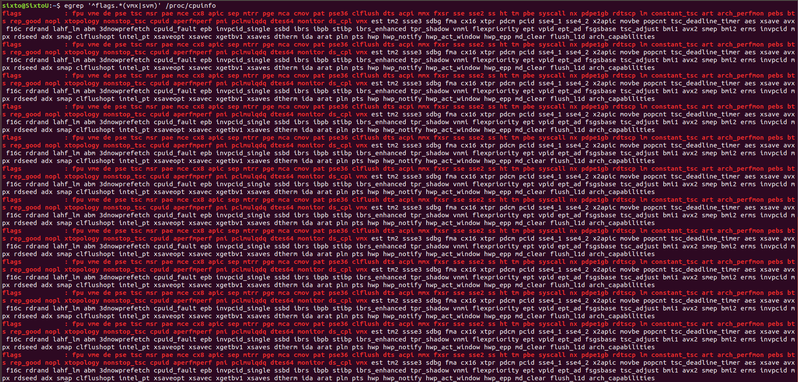
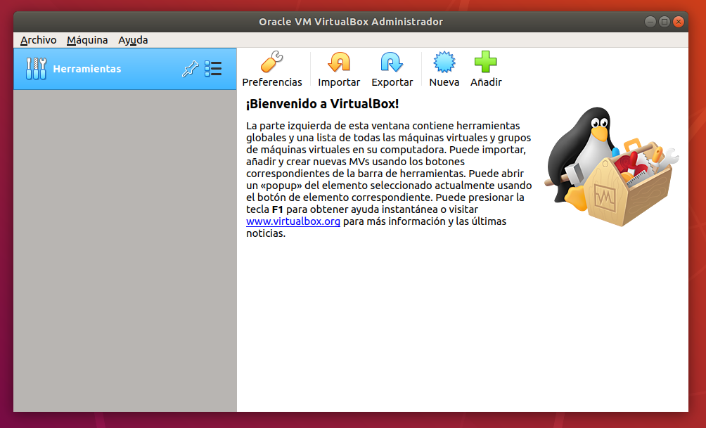

# Ejercicios1

## 1.- Consultar en el catálogo de alguna tienda de informática el precio de un ordenador tipo servidor y calcular su coste de amortización a cuatro y siete años. 

El ordenador seria el [siguiente](https://www.pccomponentes.com/hpe-proliant-dl380-gen10-intel-xeon-silver-4210-32gb).

Su precio sin IVA es de 2092,87 y con IVA de 2532,37

- Calculo el soste de amortización para 4 años 
  - Máxima amortización de 25%
  - Su coste de amortización es de 633,0925 € por año(2532,37*25%)

- Calculo el soste de amortización para 7 años 
  - Máxima amortización de 14.29%
  - Su coste de amortización es de 361,875673 € por año(2532,37*14.29%)

## 2.- Usando las tablas de precios de servicios de alojamiento en Internet “clásicos”, es decir, que ofrezcan Virtual Private Servers o servidores físicos, y de proveedores de servicios en la nube, comparar el coste durante un año de un ordenador con un procesador estándar (escogerlo de forma que sea el mismo tipo de procesador en los dos vendedores) y con el resto de las características similares (tamaño de disco duro equivalente a transferencia de disco duro) en el caso de que la infraestructura comprada se usa solo el 1% o el 10% del tiempo.

 | | [ArubaCloud](https://www.arubacloud.es/vps/tipos-virtual-private-server.aspx)|[Azure](https://azure.microsoft.com/es-es/pricing/details/cloud-services/)|
 |- |-|-|
 |CPU | 1 vcpu | 1 vcpu |
 |RAM | 2 GB | 2 GB|
 |SSD | 40 GB  | 10 GB|
 |Precio | 6.5 €/mes +IVA | 0,0523€/hora + IVA|

En estos 2 casos ,ArubaCloud que ofrece Virtual Private Servers y Azure que ofrece servicios en la nube, en el primero cobran el mes entero da igual el uso que se haga de la infraestructura mientras que en el segundo si afecta el tiempo usado.

- Para el primer caso ArubaCloud. Cuesta 6,5 €/mes por lo que: 6,5 € * 12 = 78 €/año + IVA
- Para el segundo caso Azure que si importa el tiempo usado:
    - Para un 1%, un año tiene 8760 horas el 1% de estas horas es de 87,6 horas por lo que su coste es de 4,58148 €/año + IVA.
    - Para un 10%, estas horas son 876 por lo que su coste es de 45,81 €/año + IVA.

## 3.- En general, cualquier ordenador con menos de 5 o 6 años tendrá estos flags. ¿Qué modelo de procesador es? ¿Qué aparece como salida de esa orden? Si usas una máquina virtual, ¿qué resultado da? ¿Y en una Raspberry Pi o, si tienes acceso, el procesador del móvil?

Es un Intel i7-9750H.

Ejecuto la orden indicada

    egrep '^flags.*(vmx|svm)' /proc/cpuinfo

Aparecen los siguientes flags:

## Instalar un hipervisor para gestionar máquinas virtuales, que más adelante se podrá usar en pruebas y ejercicios. Usar siempre que sea posible un hipervisor que sea software libre.

Voy a instalar virtualBox.

